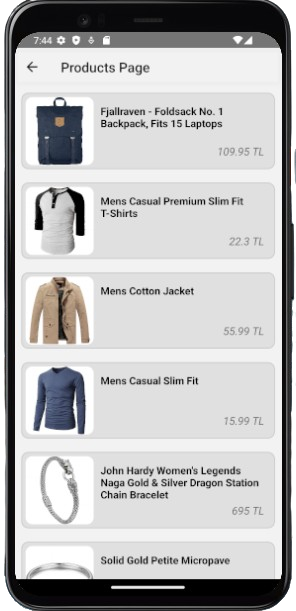

# React Native - My Store App
- An application that allows registered users to make purchases by logging in.
- In my project RESTful API(https://fakestoreapi.com) I created the APIs from the site.

## Pages
- <a href ='#Login Page'> Login Page </a>
- <a href ='#Products Page'> Products Page </a>
- <a href ='#Detail Page'> Detail Page </a>

## Features
- Made with Redux, Custom Hook, Rest API...

 

### Login Page
- The screen where users who have already registered for the application log in so that they can log in to the application.
  

  
&nbsp; &nbsp; &nbsp; &nbsp;
  

### Product Page
- Users can see the list of products they want to buy from this screen.
  

### Detail Page
- A page that allows us to have more detailed information about the product and see a photo of the product.
  

  

